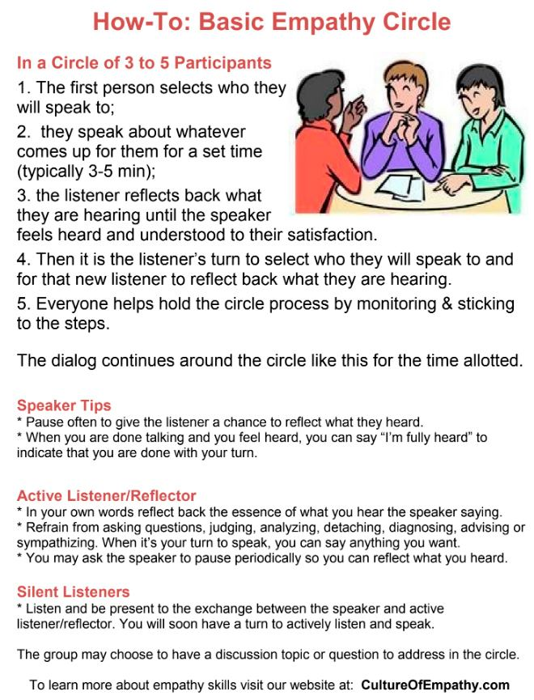

# Empathy Cafe Process

Potluck will work to validate and iterate reflective listening processes and allow the user to configure their meetings according to best practices.

Credit to Center for Building a Culture of Empathy Community Foundation, Creative Commons Attribution: [http://cultureofempathy.com](http://cultureofempathy.com)

9-minute guide on empathy circles:

[https://youtu.be/wyKW7Jebgck](https://youtu.be/wyKW7Jebgck)

25-minute guide on empathy circles \(recommended\):

[https://youtu.be/4YvVrdnA-7M](https://youtu.be/4YvVrdnA-7M)

