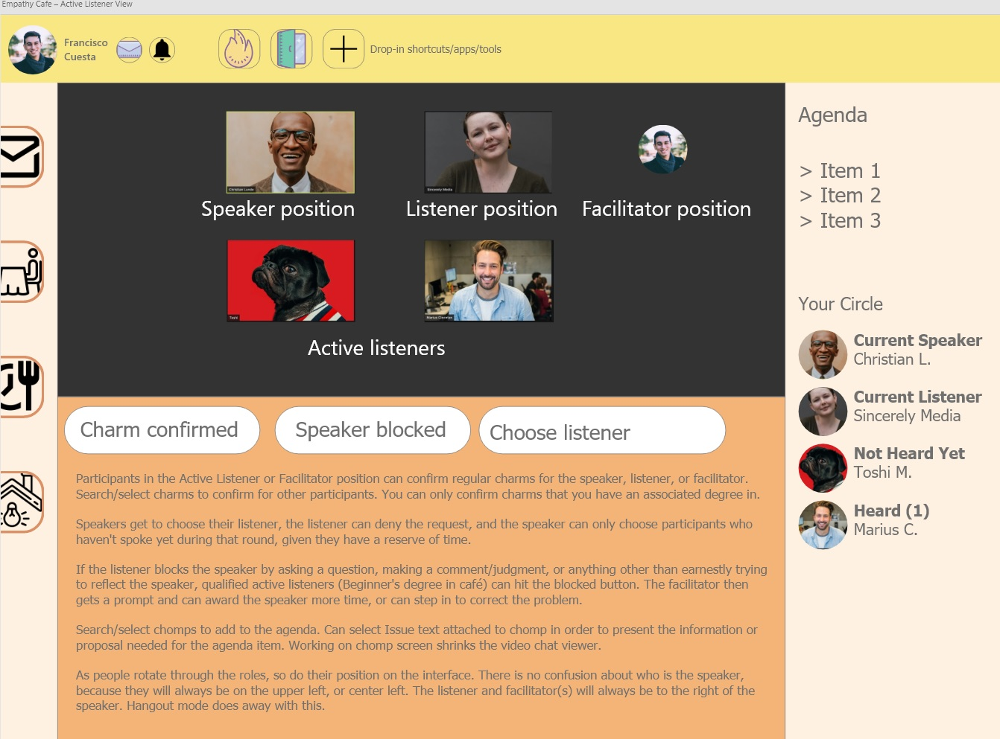
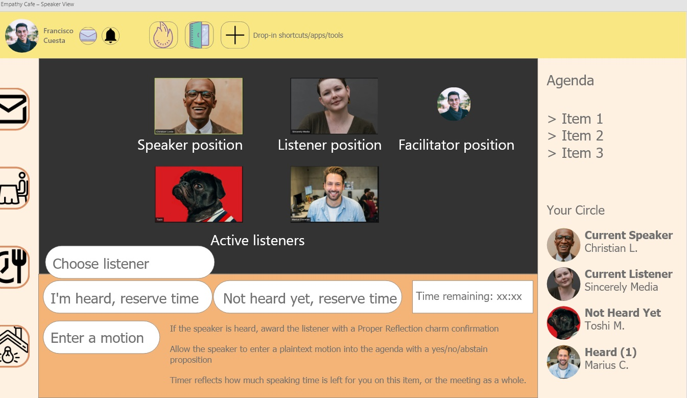
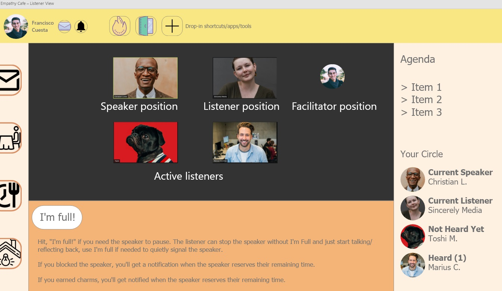
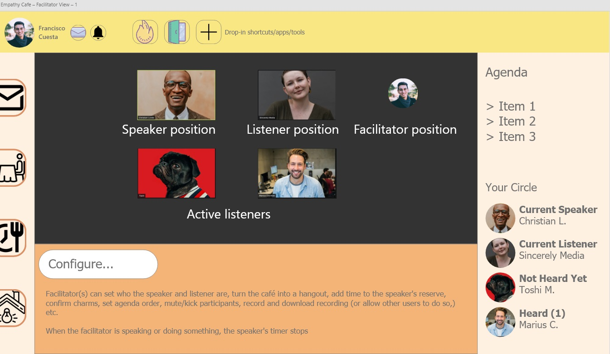

# MVP Requirements

Participants will be able to host an empathy cafe or an unstructured hangout on video conference, save a recording, and issue timestamped charm confirmations required to earn the Facilitator degree. Participants will be able to make Motions and vote on them. When the cafe is complete, the user receives an email report of the Minutes, or timestamped events of the cafe. The user will be able to use the minutes to reference parts of the meeting recording, which they can download locally during or at the conclusion of the cafe.

[Learn about the Empathy Cafe process here.](empathy-cafe-process.md) The requirements below do not instruct an overview of the process.

Participants in the Active Listener or Facilitator position can confirm regular charms for the speaker, listener, or facilitator. Search/select charms to confirm for other participants. You can only confirm charms that you have an associated degree in.

Speakers get to choose their listener, the listener can deny the request, and the speaker can only choose participants who haven't spoke yet during that round, given they have a reserve of time for the remainder of the meeting and it's agenda.

If the listener blocks the speaker by asking a question, making a comment/judgment, or anything other than earnestly trying to reflect the speaker, qualified active listeners \(Beginner's degree in café\) can hit the blocked button. The facilitator then gets a prompt and can award the speaker more time, or can step in to correct the problem.

As people rotate through the roles, so do their position on the interface. There is no confusion about who is the speaker, because they will always be on the upper left, or center left. The listener and facilitator\(s\) will always be to the right of the speaker. Hangout mode does away with this.

If the speaker is heard, award the listener with a Proper Reflection charm confirmation.

Allow the speaker to enter a plain text motion into the agenda with a yes/no/abstain proposition.

Timer reflects how much speaking time is left for you on this item, or the meeting as a whole.

Hit, "I'm full!" if you need the speaker to pause. The listener can stop the speaker without I'm Full and just start talking/reflecting back, use I'm full if needed to quietly signal the speaker.

If you blocked the speaker, you'll get a notification when the speaker reserves their remaining time.

If you earned charms, you'll get notified when the speaker reserves their remaining time.

Facilitator\(s\) can set who the speaker and listener are, turn the cafe into a hangout, add time to the speaker's reserve, confirm charms, set agenda order, mute/kick participants, record and download recording \(or allow other users to do so,\) etc.

When the facilitator is speaking or doing something, the speaker's timer stops

